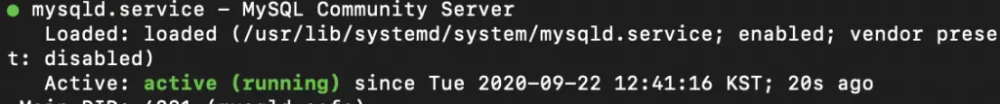
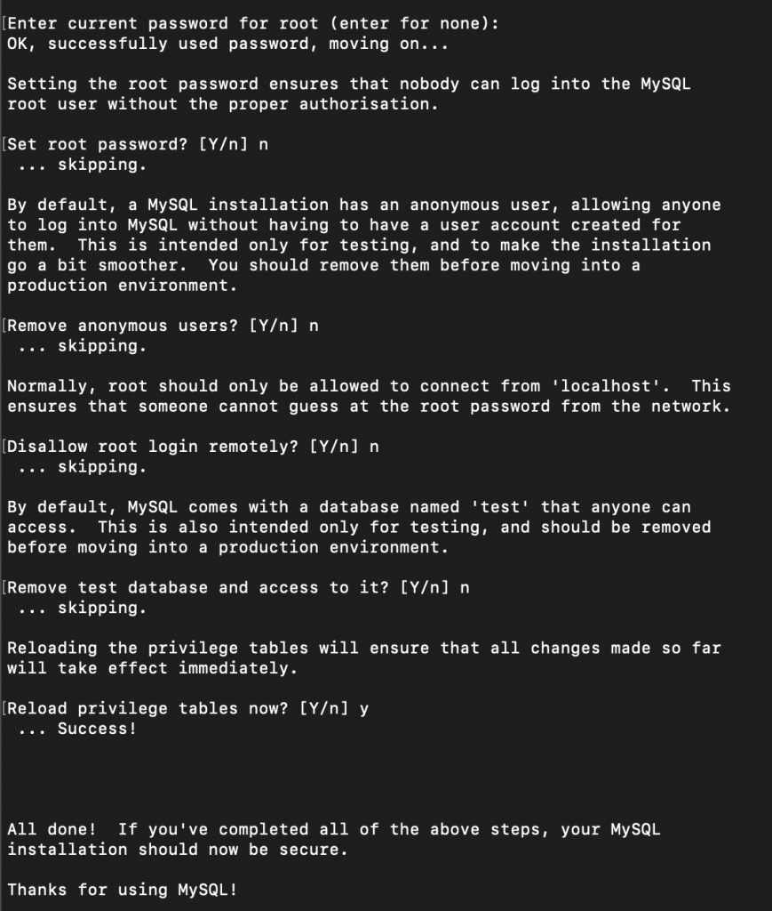
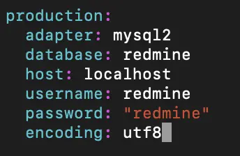

Redmine is a project management applicationo, maintained by a large [commnity](redmin.org).
Only if you have a server, you can use its enormous featrues for free.
Since there are tons of plugins especially optimized for SW development projects out there, you should check if it satifies your needs!
In this tutorial, I will cover how to install Redmine 4.0.7 on CentOS 7.6

### Before start
#### Versions
- Redmine 4.0.7
- MySQL 5.6.49
- Ruby 2.6
- Rails 5.2.0

#### Default Directory
- Redmine: /usr/local/src/redmine-4.0.7
- Ruby: /usr/local/src
- Error log: vi /etc/httpd/logs/error_log

<!-- Table of Content
Update Packages
Install Prerequisites
Install Redmine
Install Apache Passenger -->
# Table of Contents
1. [Update packages](#1-update-packages)
2. [Install Prerequisites](#2-install-prerequisites)
3. [Install Redmine](#3-install-redmine)
4. [Install Apache Passenger](#4-install-apache-passenger)


# 1. Update packages
Be sure packages are all updated before installing new one.

```bash
yum update -y
```

# 2. Install Prerequisites
## 2-1. MySQL
Download Repository

```bash
wget http://repo.mysql.com/mysql-community-release-el7-5.noarch.rpm
rpm -ivh mysql-community-release-el7-5.noarch.rpm
yum update
```
Install MySQL
```bash
yum install mysql-server
```
Install additional libraries for DB integration in Ruby
```bash
yum install mysql-community-devel
```
Check MySQL is installed properly
```bash
systemctl start mysqld
systemctl enable mysqld
systemctl status mysqld
```

_> you will see <span style="color: green">acive(running)</span>, if all goes well_

Configure credentials
```bash
mysql_secure_installation
```


```bash
systemctl restart mysqld
```
Login to MySQL
```bash
mysql -u root -p
```
Create new database and account for redmine
```sql
create database redmine character set utf8mb4;
create user 'redmine'@'localhost' identified by 'redmine';
grant all privileges on redmine.* to 'redmine'@'localhost';
flush privileges;
exit;
```
## 2-2. Ruby
Install packages for Ruby
```bash
yum install gcc-c++ patch readline readline-devel zlib zlib-devel libffi-devel \
 openssl-devel make bzip2 autoconf automake libtool bison sqlite-devel
```
Go to /usr/local/src (Ruby root directory)
```bash
cd /usr/local/src
```
Install Ruby through git
```bash
wget https://cache.ruby-lang.org/pub/ruby/2.6/ruby-2.6.5.tar.gz
tar xvf ruby-2.6.5.tar.gz
cd ruby-2.6.5
./configure
make && make install
ruby -v
```
Install bundler, chef, ruby-shadow
```bash
gem install bundler chef ruby-shadow
gem install ruby-openid
gem install mysql2
```
Install Rails
```bash
cd /usr/local/src
gem install rails -v 5.2.0
```
# 3. Install Redmine
Download and unzip redmine file
```bash
wget https://www.redmine.org/releases/redmine-4.0.7.tar.gz
tar xvfz redmine-4.0.7.tar.gz
```
Copy config file
```bash
cd redmine-4.0.7
cp config/configuration.yml.example config/configuration.yml
cp config/database.yml.example config/database.yml
```
Configure database connection
```bash
vim config/database.yml
```

Install gems required by Redmine
```bash
bundle install --without development test rmagick
```
Generate key used by Rails to encode cookies storing session data
```bash
bundle exec rake generate_secret_token
```
Create the database structure
```bash
RAILS_ENV=production bundle exec rake db:migrate
```
Configure default data in database
```bash
RAILS_ENV=production bundle exec rake redmine:load_default_data
```
Change permission of folders for writing
```bash
mkdir -p tmp tmp/pdf public/plugin_assets
cd /usr/local/src/
chown -R apache:apache redmine-4.0.7
chmod -R 755 redmine-4.0.7
```
Check
```bash
bundle exec rails server webrick -e production -b 0.0.0.0 &
```
Go to http://YOUR_IP:3000, then you will see initial page of Redmine

# 4. Install Apache Passenger
Install required libraries
```bash
yum -y install httpd libcurl-devel httpd-devel apr-devel apr-util-devel
```
Install passenger through gem
```bash
gem install passenger
```
Install apache module through passenger
```bash
passenger-install-apache2-module
```
Go to apache config file root
```bash
cd /etc/httpd/conf
vi httpd.conf
```
Add lines below
```
LoadModule passenger_module /usr/local/lib/ruby/gems/2.6.0/gems/passenger-6.0.6/buildout/apache2/mod_passenger.so
<IfModule mod_passenger.c>
  PassengerRoot /usr/local/lib/ruby/gems/2.6.0/gems/passenger-6.0.6
  PassengerDefaultRuby /usr/local/bin/ruby

<VirtualHost *>
  ServerName redmine.com
  DocumentRoot /usr/local/src/redmine-4.0.7/public
  ErrorLog logs/redmine_error_log
    <Directory "/usr/local/src/redmine-4.0.7/public">
      Options FollowSymLinks
      AllowOverride None
      Require all granted
    
  Options Indexes FollowSymLinks MultiViews
  RailsEnv production
  RailsBaseURI /
```
Restart Apache server
```bash
systemctl restart httpd
```
That’s all! If you go to http://YOUR_IP:80, you will see redmine’s initial webpage running on apache server!

